# LocalClip Editor - Windows 打包工具

> 将 LocalClip Editor 打包成完全独立的 Windows 可执行程序

[](https://www.python.org/)
[](https://www.microsoft.com/windows)
[](LICENSE)

## 📖 概述

本工具集提供完整的自动化打包方案，将 LocalClip Editor 打包成：

- ✅ **独立可执行程序** - 无需安装 Python 或任何依赖
- ✅ **完全离线运行** - 包含所有 AI 模型（5-8GB）
- ✅ **一键启动** - 双击即可运行
- ✅ **跨平台构建** - 可在 Windows/macOS/Linux 上打包

**打包产物**: 6-8 GB 的完整应用程序包
**打包时间**: 30-60 分钟

---

## 🚀 快速开始

### 一键打包

```bash
# 1. 进入打包目录
cd windows_package

# 2. 安装 PyInstaller
pip install pyinstaller

# 3. 执行完整打包
python build_package.py
```

打包完成后，在 `dist/` 目录找到：
- `LocalClip-Editor/` - 可分发的完整应用
- `LocalClip-Editor-Windows-v1.0.0.zip` - 压缩包

详见: [快速开始指南 (QUICKSTART.md)](QUICKSTART.md)

---

## 📂 文件说明

| 文件 | 说明 |
|------|------|
| `build_package.py` | 🔧 **主打包脚本** - 自动化完整打包流程 |
| `download_models.py` | 📥 **模型下载脚本** - 下载所有 AI 模型和 FFmpeg |
| `build_frontend.py` | 🎨 **前端构建脚本** - 构建 React 前端为静态文件 |
| `localclip_editor.spec` | 📦 **PyInstaller 配置** - 后端打包配置 |
| `config.yaml` | ⚙️ **打包配置文件** - 自定义打包选项 |
| `templates/start_windows.bat` | 🚀 **Windows 启动脚本** - 用户启动应用 |
| `PACKAGE_README.md` | 📖 **详细文档** - 完整的打包指南 |
| `QUICKSTART.md` | ⚡ **快速指南** - 5 分钟快速上手 |
| `README.md` | 📄 **本文档** - 项目概述 |

---

## 📦 打包流程

```mermaid
graph LR
    A[1. 检查环境] --> B[2. 下载模型]
    B --> C[3. 构建前端]
    C --> D[4. 打包后端]
    D --> E[5. 组装包]
    E --> F[6. 创建文档]
    F --> G[7. 生成压缩包]
    G --> H[✅ 完成]
```



### 详细步骤

1. **检查环境** - 验证 Python、Node.js、依赖包
2. **下载模型** - 下载 HuggingFace 模型、Fish-Speech、FFmpeg
3. **构建前端** - 使用 Vite 构建 React 应用
4. **打包后端** - 使用 PyInstaller 打包 Python 后端
5. **组装包** - 整合所有组件到最终目录
6. **创建文档** - 生成用户使用说明
7. **生成压缩包** - 创建 ZIP 文件便于分发

---

## 🎯 打包产物

### 目录结构

```
LocalClip-Editor/
├── 启动 LocalClip Editor.bat    # 🚀 启动程序
├── 使用说明.txt                  # 📖 用户文档
├── backend/                      # 后端服务
│   ├── LocalClipEditor.exe       # 主程序
│   └── _internal/                # 依赖库 (~2GB)
├── frontend/                     # 前端静态文件
│   └── dist/
├── models/                       # AI 模型 (5-8GB)
│   ├── fish_speech/              # Fish-Speech 模型
│   ├── pyannote/                 # 说话人识别
│   └── wav2vec2/                 # 性别识别
├── ffmpeg/                       # FFmpeg 工具
│   ├── ffmpeg.exe
│   └── ffprobe.exe
├── uploads/                      # 用户上传目录
├── exports/                      # 导出目录
└── logs/                         # 日志目录
```

### 体积分解

| 组件 | 大小 |
|------|------|
| 后端 (Python + 依赖) | ~2 GB |
| Fish-Speech 模型 | ~3.4 GB |
| 其他 AI 模型 | ~1 GB |
| FFmpeg | ~100 MB |
| 前端静态文件 | ~10 MB |
| **总计** | **6-8 GB** |

---

## 🛠️ 系统要求

### 打包环境（开发机）

- **操作系统**: Windows 10/11, macOS, 或 Linux
- **Python**: 3.10+
- **Node.js**: 16.0+
- **磁盘空间**: 20GB+
- **内存**: 16GB+ 推荐
- **网络**: 首次需要联网下载模型

### 运行环境（用户机）

- **操作系统**: Windows 10/11 (64位)
- **内存**: 8GB+ 推荐
- **磁盘空间**: 10GB+
- **网络**: 无需联网，完全离线

---

## 📚 文档

- 📖 [详细打包指南](PACKAGE_README.md) - 完整的打包流程和配置
- ⚡ [快速开始](QUICKSTART.md) - 5 分钟快速上手
- 🐛 [常见问题](PACKAGE_README.md#常见问题) - 疑难解答
- ⚙️ [高级配置](PACKAGE_README.md#高级配置) - 自定义打包选项

---

## 🎓 使用示例

### 基础打包

```bash
# 完整打包
python build_package.py
```

### 高级用法

```bash
# 跳过模型下载（如果已下载）
python build_package.py --skip-models

# 跳过前端构建（如果已构建）
python build_package.py --skip-frontend

# 自定义 Fish-Speech 路径
python build_package.py --fish-speech-path /path/to/fish-speech

# 只下载模型
python download_models.py

# 只构建前端
python build_frontend.py

# 验证模型完整性
python download_models.py --verify-only
```

---

## 🔧 脚本说明

### build_package.py

主打包脚本，协调所有打包步骤。

**用法**:
```bash
python build_package.py [选项]

选项:
  --fish-speech-path PATH    Fish-Speech 项目路径
  --skip-models              跳过模型下载
  --skip-frontend            跳过前端构建
```

**输出**: `dist/LocalClip-Editor/`

### download_models.py

下载和管理 AI 模型。

**用法**:
```bash
python download_models.py [选项]

选项:
  --models-dir DIR           模型保存目录 (默认: models)
  --fish-speech-path PATH    Fish-Speech 路径
  --skip-huggingface         跳过 HuggingFace 模型
  --skip-fish-speech         跳过 Fish-Speech 模型
  --skip-ffmpeg              跳过 FFmpeg 下载
  --verify-only              仅验证，不下载
```

### build_frontend.py

构建 React 前端。

**用法**:
```bash
python build_frontend.py [选项]

选项:
  --frontend-dir DIR         前端目录 (默认: ../frontend)
  --backend-dir DIR          后端目录 (默认: ../backend)
  --skip-install             跳过依赖安装
  --skip-modify-backend      跳过后端修改
  --clean                    清理旧构建
```

---

## 🧪 测试

打包完成后，建议在真实 Windows 环境中测试：

1. **解压测试**
   ```bash
   # 解压打包结果
   unzip LocalClip-Editor-Windows-v1.0.0.zip
   ```

2. **启动测试**
   ```cmd
   # 双击或命令行运行
   cd LocalClip-Editor
   "启动 LocalClip Editor.bat"
   ```

3. **功能测试**
   - 上传视频
   - 上传字幕
   - 说话人识别
   - 视频导出

---

## 🐛 故障排除

### PyInstaller 打包失败

```bash
# 清理缓存
pyinstaller --clean localclip_editor.spec

# 重新安装 PyInstaller
pip uninstall pyinstaller
pip install pyinstaller
```

### 模型下载失败

```bash
# 使用镜像
export HF_ENDPOINT=https://hf-mirror.com
python download_models.py

# 手动下载并放置到 dist/models/
```

### 前端构建失败

```bash
# 清理并重新安装
cd frontend
rm -rf node_modules package-lock.json
npm install
npm run build
```

更多问题见: [常见问题](PACKAGE_README.md#常见问题)

---

## 📊 性能优化

### 减小体积

1. **分离模型包** - 主程序 + 可选模型包
2. **移除不需要的模型** - 只保留核心功能
3. **使用量化模型** - 减少模型体积

### 加快打包速度

1. **使用 SSD** - 提升 I/O 速度
2. **禁用 UPX** - 已默认禁用
3. **缓存构建** - 使用 `--skip-models` 等选项

---

## 🤝 贡献

欢迎提交 Issue 和 Pull Request！

### 开发工作流

1. Fork 本仓库
2. 创建功能分支 (`git checkout -b feature/amazing-feature`)
3. 提交改动 (`git commit -m 'Add amazing feature'`)
4. 推送到分支 (`git push origin feature/amazing-feature`)
5. 创建 Pull Request

---

## 📄 许可证

本项目遵循 Apache 2.0 许可证。

---

## 📞 支持

- 🐛 **问题反馈**: [GitHub Issues](https://github.com/your-repo/issues)
- 💬 **讨论**: [GitHub Discussions](https://github.com/your-repo/discussions)
- 📧 **邮件**: your-email@example.com

---

## 🙏 致谢

- [PyInstaller](https://www.pyinstaller.org/) - Python 打包工具
- [FastAPI](https://fastapi.tiangolo.com/) - 现代 Web 框架
- [React](https://react.dev/) - 前端框架
- [Fish-Speech](https://github.com/fishaudio/fish-speech) - 语音克隆
- [pyannote.audio](https://github.com/pyannote/pyannote-audio) - 说话人识别
- [FFmpeg](https://ffmpeg.org/) - 视频处理

---

**最后更新**: 2024-12-09

**版本**: 1.0.0

开始打包你的应用吧！ 🚀
